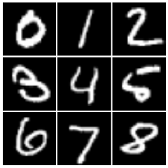

<h1 align="center">Cross-Domain Visual Correspondence</h1>

   Shape / Bird / Object correspondences" width="320">

Each block above is a 3x3 matrix of digits 0-8. Reading left to right, the four columns are the
same digits, then the dSprites shape, the CUB bird, and the CIFAR-10 object each digit was
matched to. Each row is an independent set (the digit matrix and its equivalents), so the layout
stays aligned cell-for-cell and can be flipped through as animation frames.

## Datasets

Four visual domains chosen to span a spectrum from controlled to messy, not just for variety:

| Domain | Dataset | Role |
|---|---|---|
| Digits | MNIST | Symbolic source shapes (the "query") |
| Shapes | dSprites | Controlled synthetic geometry |
| Birds | CUB-200-2011 | Natural organic silhouettes |
| Objects | CIFAR-10 | Complex real-world imagery |

Worth stating plainly rather than glossing over: dSprites only contains three shape families
(square, ellipse, heart), so the "Shape" column can never be very expressive no matter how good
the matching is that is a property of the dataset, not the method. CUB birds are cropped to
their provided bounding boxes so the silhouette, not the background, drives the match. CIFAR-10
images are only 32x32, so their contribution is coarse by construction.

## Method

Everything is training-free and non-parametric there is no model to fit. The cross-domain
matching is unsupervised; digit class labels are used only to group MNIST examples into one
averaged prototype per digit.

Each image is reduced to a shape descriptor. Every image is converted to grayscale, resized to
64x64, and contrast-normalized, then turned into a Histogram of Oriented Gradients (HOG) vector,

$$
\phi : \mathbb{R}^{64\times64} \rightarrow \mathbb{R}^{D},
$$

which encodes local edge orientation and discards absolute brightness. For birds and objects the
HOG is computed on a Sobel edge map rather than the raw grayscale, so the descriptor follows the
subject's *contour* instead of its photographic texture. Each digit's prototype is the mean HOG
over several clean examples of that digit.

Matching is nearest-neighbor by cosine similarity,

$$
\text{sim}(p, t) = \frac{(p-\mu)\cdot(t-\mu)}{\lVert p-\mu\rVert\,\lVert t-\mu\rVert},
$$

where $p$ is a digit prototype, $t$ a candidate target, and $\mu$ the mean of the target
domain's descriptors. Subtracting $\mu$ (mean-centering) removes the component every image shares
so the scores spread out and a few generic images stop winning every comparison. Correspondences
are then assigned one-to-one across the nine digits with the Hungarian algorithm,

$$
\hat{\sigma} = \arg\max_{\sigma}\ \sum_{d=0}^{8}\text{sim}\big(p_d,\ t_{\sigma(d)}\big),
$$

so no target can be reused and each digit gets a distinct match.

## What it produces

Running the notebook top to bottom against the four datasets produces, per domain, the closest
match for each digit 0-8, laid out as aligned 3x3 matrices and as the multi-row collage above.
There is deliberately **no accuracy table here** the task has no ground-truth "correct" digit-to-bird
mapping, so reporting an accuracy would be meaningless. The output is the correspondence itself,
plus the cosine score for each match as a rough confidence.

## Known limitation

This is nearest-neighbor retrieval in a high-dimensional feature space, and such spaces always
return *a* closest neighbor whether or not the resemblance is real. Two things follow. First,
without a chance baseline there is no way to know if a given digit-bird pairing is meaningfully
shape-driven or just the least-bad option a permutation test (shuffle the correspondences many
times and check whether the real matches score higher than random) is the honest next step and
has not been done yet. Second, HOG is a hand-designed shape descriptor; learned representations
(a CNN embedding or an autoencoder latent space) would capture structure HOG cannot, and would
let the same pipeline be compared across representations rather than assuming HOG is best.
